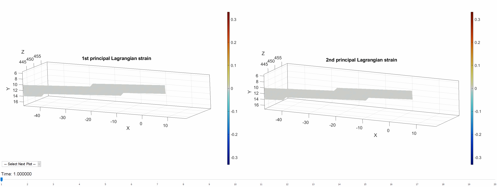

# `DuoDIC`: a `MATLAB` Toolbox for stereo 3D Digital Image Correlation (3D-DIC)  

Cite `DuoDIC`: 

- [Summary](#Summary)  
- [Installation](#Installation)  
- [Getting started](#Start)
- [Citing](#Cite)
- [Contributing](#Contributing)  
- [License](#License)  
- [Application Highlights](#Applications)

## Summary 
`DuoDIC` is an open-source MATLAB toolbox by [Dana Solav's research group at Technion](https://www.solavlab.com/) for three-dimensional (stereo) Digital Image Correlation (3D-DIC) using two cameras. For multi-view (3 cameras or more), please visit our [MultiDIC toolbox](https://github.com/MultiDIC/MultiDIC). 3D-DIC is an important technique for measuring the mechanical behavior of materials. `DuoDIC` was developed to allow simple calibration and data processing, and to be easily adaptable to different experimental requirements. `DuoDIC` integrates the 2D-DIC subset-based software [Ncorr](https://www.github.com/justinblaber/ncorr_2D_matlab) with MATLAB's camera calibration algorithms to reconstruct 3D surfaces from stereo image pairs. Moreover, it contains algorithms for computing and visualizing 3D displacement, deformation and strain measures. High-level scripts allow users to perform 3D-DIC analyses with minimal interaction with MATLAB syntax, while proficient MATLAB users can also use stand-alone functions and data-structures to write custom scripts for specific experimental requirements. Comprehensive documentation, [instruction manual](https://github.com/SolavLab/DuoDIC/blob/master/docs/instructions/DuoDIC_v_1_1_0_instruction_manual.pdf), and [sample data](https://github.com/SolavLab/DuoDIC/tree/master/sample_data) are included.

## Installation   
### System Requirements
`DuoDIC` was developed and tested on 64-bit Windows 10 and has not yet been tested on other platforms.        
#### MATLAB
`DuoDIC` was developed on MATLAB versions R2021a and R2021b, and has not yet been tested on prior versions.  

MATLAB toolbox dependencies:
* Image Processing Toolbox
* Computer Vision System Toolbox
* Statistics and Machine Learning Toolbox

### Installation Instructions
To install `DuoDIC` simply follow these two steps:
#### 1. Get a copy of `DuoDIC`
Use **one** of these two options:  
**a.** Clone `DuoDIC` using: `git clone https://github.com/SolavLab/DuoDIC.git`.    
**b.** Download and unzip the latest [zip file](https://github.com/SolavLab/DuoDIC/archive/refs/heads/main.zip).   

#### 2. Install
In MATLAB, navigate to the (unzipped) `DuoDIC` folder, type `install_DuoDIC` in the command window, and hit Enter.

## Getting started 
Check out the [instruction manual](docs/instructions/DuoDIC_instruction_manual_1_1_0.pdf). It should have all the information you need to get started.

## Citing    
This is the official repository for the paper:
[`DuoDIC`: 3D Digital Image Correlation in `MATLAB`'](https://joss.theoj.org/papers/10.21105/joss.04279)   
DOI: 

Please cite this paper if you use the toolbox.

## Contributing    
If you wish to contribute code/algorithms to this project, or to propose a collaboration study, please send an email to danas@technion.ac.il .

## License 
`DuoDIC` is provided under the . The [license file](https://github.com/SolavLab/DuoDIC/blob/main/LICENSE.txt) is found on the GitHub repository.

## Application Highlights 
### These are some examples of figures obtained directly using `DuoDIC`:
#### Diplacement and principal strain fields of a dogbone sample under uniaxial tension
     
   
