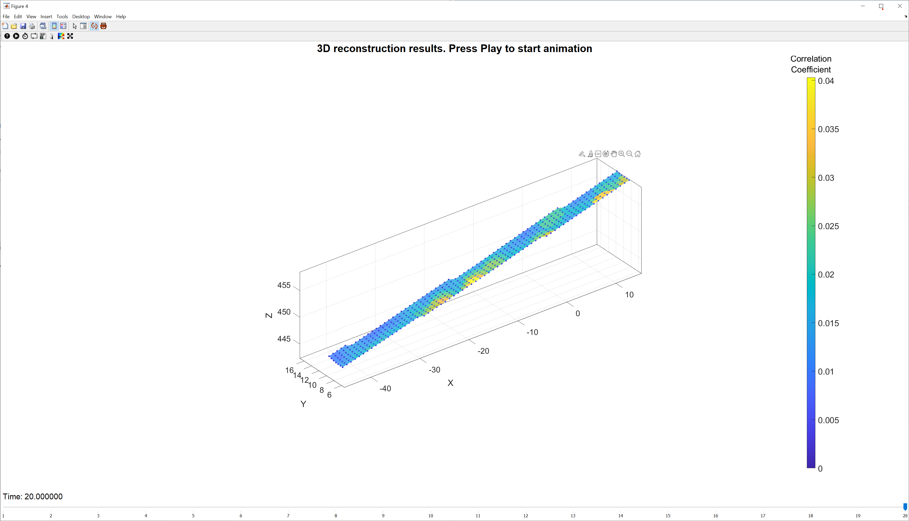
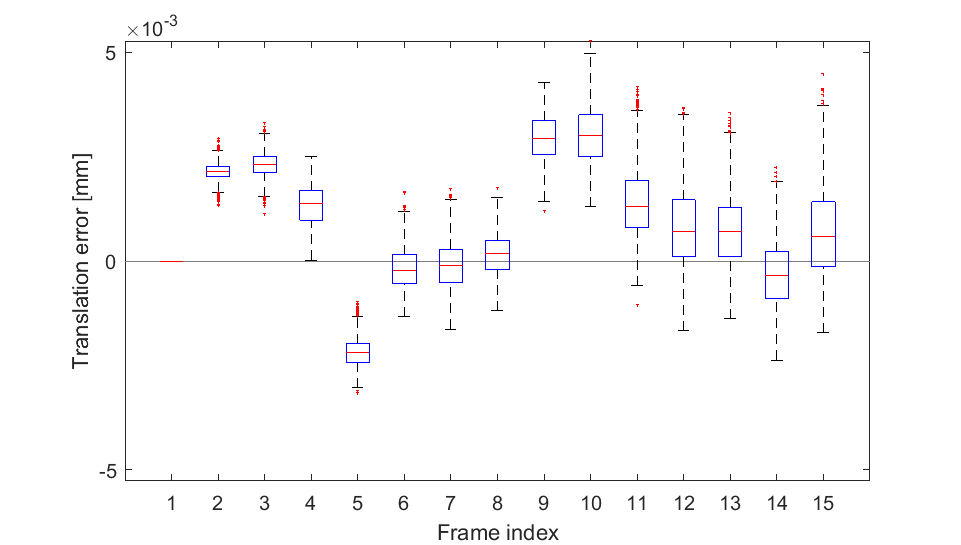
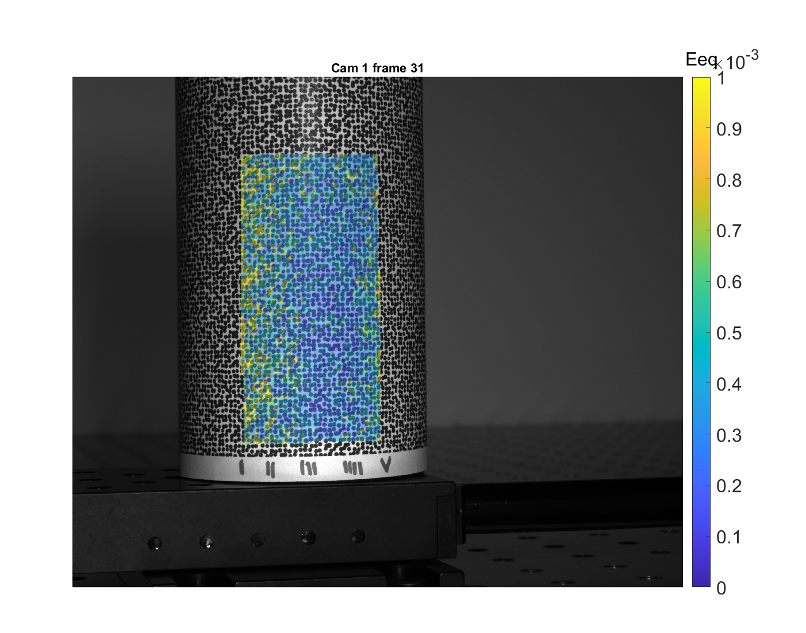

# Summary

Three-dimensional Digital Image Correlation (3D-DIC) is a non-contact optical-numerical technique for evaluating the shape and full-field displacement, deformation, and strain, from stereo digital images of the surface of an object. 3D-DIC is useful for characterizing the mechanical behavior of material and structures, for quantifying material parameters, and validating numerical simulations.

`DuoDIC` is a freely available open source MATLAB toolbox for 2-camera stereo 3D-DIC, which can be used either as a standalone package or as functions in external scripts. `DuoDIC` takes in two series of synchronized digital images taken from two cameras. The first series, containing a flat checkerboard target, is used to calibrate the camera pair, and the second series contains the speckled test object undergoing movement and deformation. The toolbox can be used to output and visualizes the dynamic 3D point cloud, meshed surface, rigid body motion, and full-field displacement, deformation, and strain measures. `DuoDIC` integrates the bundle adjustment stereo camera calibration algorithm with the 2D subset-based DIC software `Ncorr`, as well as advanced functions to compute and visualize various 3D measures of shape, displacement, deformation, and strain.

The user interface allows novice users to perform 3D-DIC analyses without interacting with MATLAB syntax, while stand-alone functions can be integrated in custom scripts by more proficient MATLAB users. As such, `DuoDIC` is suitable for students, researchers, and professionals from various fields.

The package is composed of four main scripts: 1) stereo calibration; 2) image cross-correlation; 3) 3D reconstruction; and 4) post-processing. This paper describes the algorithms implemented in each step and demonstrates its performance in two test cases, which are included as sample data: rigid body translations of a cylindric container and uniaxial tension of a rubber dog-bone specimen.

# Statement of need

3D-DIC is useful in numerous applications where the full-field displacements and strains are required, primarily for measuring the mechanical response of materials and structures and for characterizing the mechanical properties, with widespread applications from nano- to macro-scale, and rapid progress and developments [@Reu2015, @Sutton2017, @Pan2018]. 3D-DIC is preferable over strain gages and extensometers due to its non-contact nature and the large amount of information that can be collected.

Commercial 3D-DIC software are typically expensive, proprietary and closed-source, which may pose a barrier, especially for students and researchers. Notable free and open-source 3D-DIC contributions include `DICe` [@Turner2015], `ADIC3D` [@Atkinson2021], and `MultiDIC` [@Solav2018]. Each of these packages uses different algorithms for correlation and stereo calibration, and requires different calibration targets. One of the main advantages of open-source software is the ability to compare their results and performance, and cross-validate  implementation of different algorithms and approaches.

Specifically, our previous toolbox `MultiDIC` focused on multi-view applications, therefore required a non-planar calibration object, which is relatively difficult to make accurate, thus preventing easy implementation. To this end, `DuoDIC` enables a simpler calibration procedure that requires only a flat checkerboard pattern. In addition, with respect to `MultiDIC` we improved the post-processing and visualization options. `DuoDIC` is written in MATLAB, providing the flexibility and simple implementation of a high-level language, which meets the needs of the experimental mechanics community.

# Algorithms and workflow
The entire 3D-DIC procedure in `DuoDIC` is organized in four main scripts, which the user can run without having to interact with any MATLAB syntax. Figure \autoref{fig:workflow} outlines the workflow of the 3D-DIC procedure. The functionality and algorithms incorporated in each step are detailed below.
The figures in this section represent data that is included with the software. The experimental setup consisted of two machine-vision cameras (BFS-U3-51S5M-C, FLIR, USA) equipped with a 5.0 MP Sony IMX250 monochrome sensor and a 12.5 mm lens (Fujinon HF12.5SA-1, Fujifilm Corporation, Japan). The cameras were synchronously hardware-triggered using a MatchID triggerbox (MatchID, Belgium). A rubber dog-bone specimen was mounted on an optical table (Thorlabs, USA), such that its left end was fixed and its right end was moved to the right in 20 steps of 1 mm. In each step, simultaneous images were captured by both cameras.

## Step 1: Stereo camera calibration
In this step, the intrinsic and extrinsic parameters of both cameras are computed, by integrating functions from MathWorks Computer Vision Toolbox, which implement algorithms by Zhang [@Zhang2000], Heikkila and Silven [@Heikkila1997], Bouguet [@Bouguet], and Bradski and Kaehler [@Bradski2008]. The script receives multiple images of a checkerboard target captured simultaneously by two cameras in a stereo pair. The checkerboard pattern in each image is automatically detected, and used for calibrating the camera intrinsic and stereo parameters. The intrinsic parameters include focal lengths, principal point (optical center), and up to 6 distortion coefficients. The user can choose between [0,2,3] radial distortion coefficients, [0,2] tangential distortion coefficients, and [0,1] skew parameter. The stereo camera parameters comprise the position and orientation of the second camera with respect to the first. The estimated camera parameters are then used for computing the reprojection errors, which represent the distance between the reprojected and the detected pattern points, and comprise the accuracy of the estimated camera parameters. An example of the results presented at the end of this step is shown in \autoref{fig:calibration}

## Step 2: Image cross-correlation (2D-DIC)
In this step, the toolbox receives multiple images of the speckled test object captured simultaneously by the same camera pair. Typically, the first pair of images represents the unloaded (or undeformed) configuration and the rest of the images represent deformed states. Ncorr toolbox [@Blaber2015] is utilized in this step to detect a dense grid of matching points on all images. Although Ncorr was created as a 2D-DIC toolbox, receiving images from a single camera, `DuoDIC` utilizes it to detect matching points on images taken from two different views. All the images from both cameras are correlated with the reference image, to detect corresponding points in the selected region of interest (ROI), as demonstrated in \autoref{fig:corr}. Furthermore, the grid of correlated points is meshed with triangular elements, which are used for deformation and strain calculation, as described in Step 4.

## Step 3: 3D reconstruction
The results from Step 1 and Step 2 are combined in this step to obtain the 3D position of each image point using stereo triangulation. The set of matching points on each pair of stereo images (as computed in Step 2) are first being undistorted using the intrinsic camera parameters of each camera, according to the distortion model selected in Step 1. Consequently, the image points are transformed into 3D world points using the stereo camera parameters computed in Step 1. In addition, the reprojection error is obtained for each point, by calculating the distance (in pixels) between the detected and the reprojected point. At the end of this step, the 3D point cloud and triangulated surface are plotted and animated, with the face colors representing the values of the matching correlation coefficient and the reprojection errors, as shown in \autoref{fig:step3}.

## Step 4: Post processing
The 3D coordinates calculated in Step 3 are used in this step to derive the full-field displacement, deformation, and strain maps. The displacements are calculated for each point (vertices of the triangular elements), and the deformations and strains are calculated for each triangular element using the Cosserat point element method [@Solav2014, @Solav2016, @Solav2017, @Solav2017b]. Detailed information on the post processing methods can be found in the `MultiDIC` paper [@Solav2018]. In short, for each triangular element, the position vectors of the vertices are used to calculate the deformation gradient tensor ($\textbf{F}$), from which the right and left Cauchy-Green deformation tensors are derived ($\textbf{C}$ and $\textbf{B}$, respectively), as well as the Green-Lagrangian and Eulerian-Almansi strain tensors ($\textbf{E}$ and $\textbf{e}$, respectively). The principal components and directions of these tensors are computed for deriving the principal stretches and strains ($\lambda_{i}$ and $E_{i}$, respectively), as well as the equivalent strain, maximal shear strain, and area change. \autoref{fig:princ_stretch_3d} and \autoref{fig:disp_2d} show two example figures, plotting the first and second principal Lagrangian strains (magnitude and directions) on the 3D surface, and the displacement magnitudes overlaid on the images, respectively.

# Validation using a rigid body motion (RBM) test
To assess the metrological performance of `DuoDIC`, we performed a rigid body motion experiment, whereby a speckled cylinder was translated using a motorized linear translation stage (PT1/M-Z8, Thorlabs, USA), in 10 increments of 0.1 mm. By comparing the displacements measured using the translation stage with those computed using 3D-DIC, the displacement errors were quantified, as shown in  \autoref{fig:disp_err}. In addition, since strain is expected to vanish for any RBM, any non-zero strains measured represent measurement errors. \autoref{fig:strain_err} plots the strains measured during the RBM translations.

<!--  -->

# Acknowledgements
This project was supported by Dana Solav's Jacques Lewiner Career Advancement Chair.

# References
